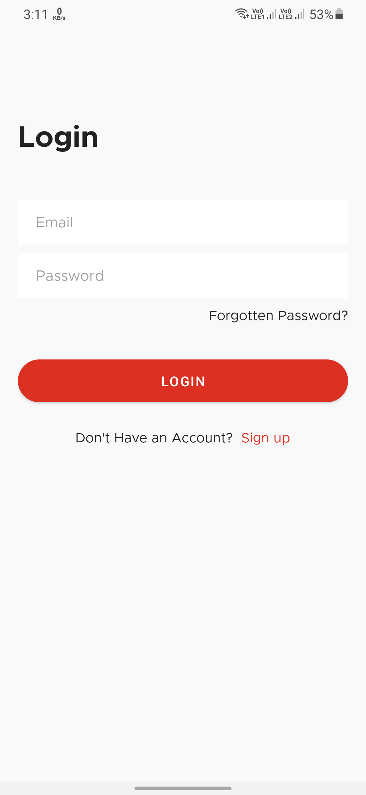
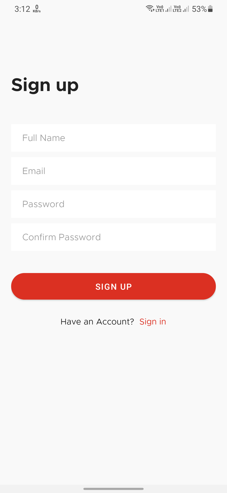
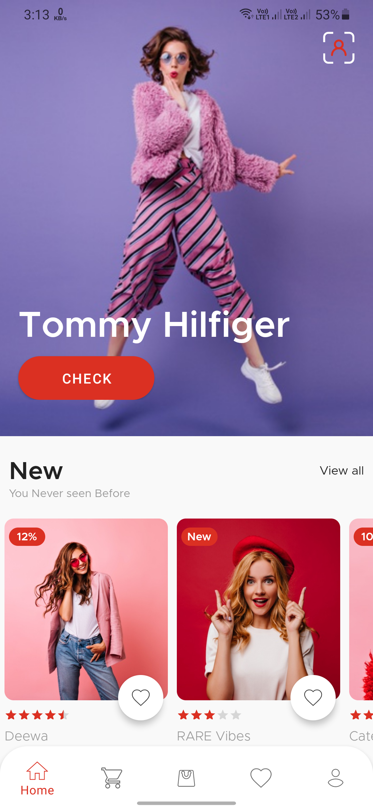
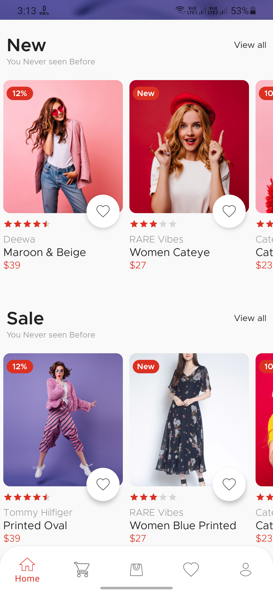
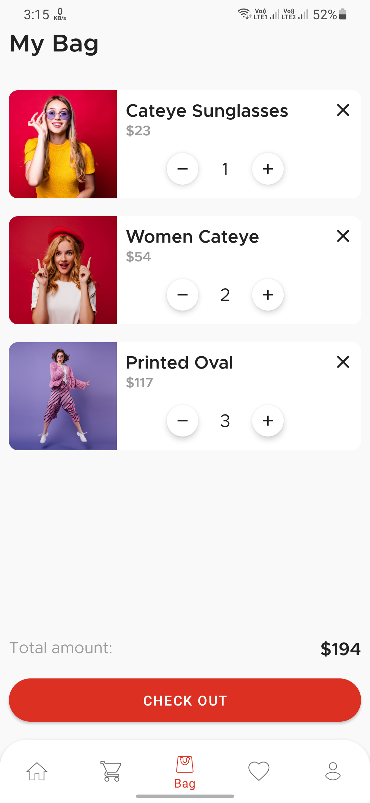
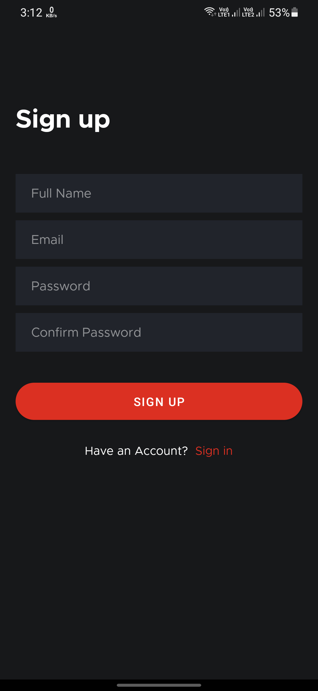
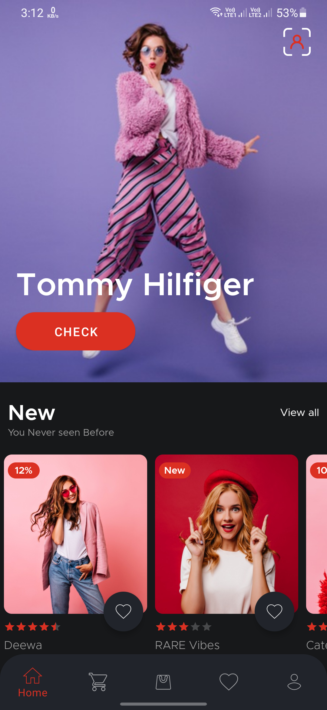
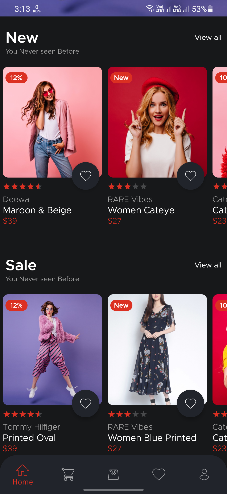
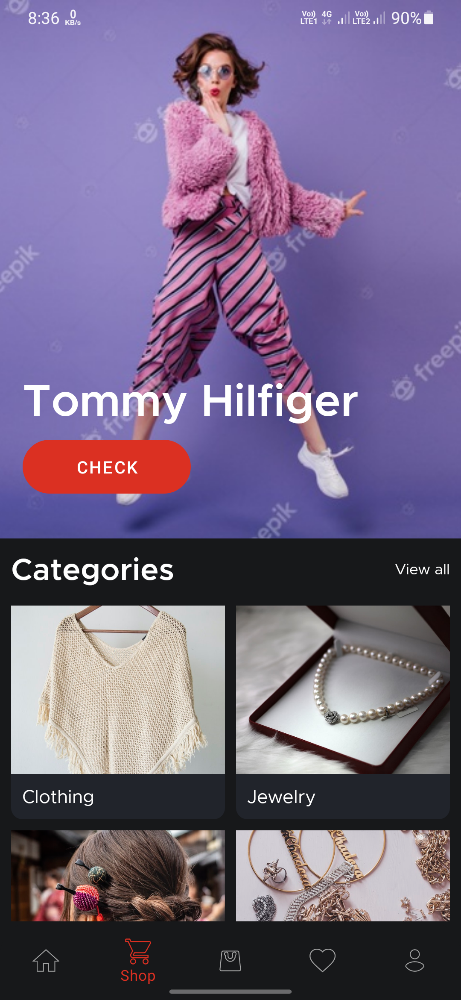
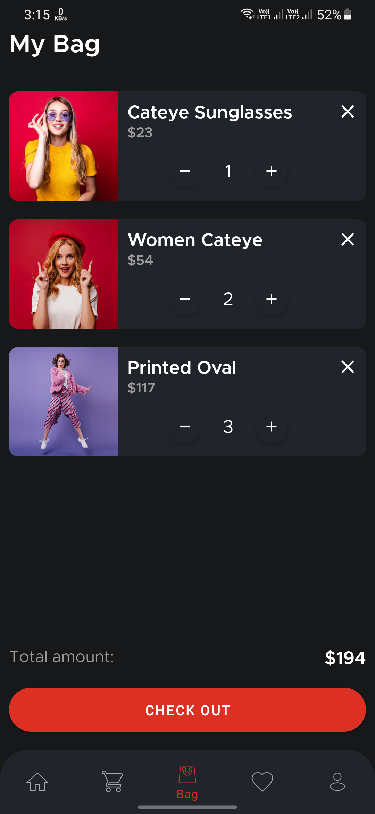

# 📱 SocioBuy Android App

SocioBuy is a revolutionary social commerce Android application that combines the power of **artificial intelligence**, **machine learning**, and **social networking** to create a personalized shopping experience. The app features cutting-edge **visual search technology** powered by TensorFlow Lite, allowing users to search for products by simply taking or uploading photos.

## 🌟 Complete SocioBuy Ecosystem

- **📱 Android App** (This Repository): Mobile frontend
- **🔧 Backend API**: [SocioBuy Backend](https://github.com/shubhamkumaar/socioBuy_backend) - FastAPI + Neo4j + Gemini AI for social commerce recommendations

## ✨ Key Features


### 🤝 Social Commerce
- **Friend Networks**: Connect with friends and discover what they're buying
- **Social Recommendations**: Get personalized suggestions based on your social circle's preferences
- **Purchase Influence Tracking**: See trending products among your friends
- **Social Sharing**: Share your favorite finds and purchases with your network

### 🛒 Smart Shopping Experience
- **Personalized Home Feed**: AI-curated product recommendations based on social data
- **Intelligent Cart**: Smart suggestions while shopping
- **Category-based Discovery**: Explore products by categories popular in your network
- **Wishlist & Favorites**: Save products for later with social insights

### 🎨 Modern UI/UX
- **Material Design 3**: Beautiful, intuitive interface following Google's latest design guidelines
- **Dark Mode Support**: Complete dark theme for comfortable browsing
- **Smooth Animations**: Lottie-powered animations for delightful interactions
- **Responsive Design**: Optimized for all Android screen sizes

## 🛠️ Tech Stack

### Core Technologies
- **[Kotlin](https://kotlinlang.org/)** - Modern, concise programming language for Android
- **[Android Jetpack](https://developer.android.com/jetpack)** - Suite of libraries for robust app development
- **[Material Components](https://github.com/material-components/material-components-android)** - Material Design UI components

### Backend Integration
- **[Retrofit](https://square.github.io/retrofit/)** - Type-safe HTTP client for API communication
- **[OkHttp](https://square.github.io/okhttp/)** - Efficient HTTP client with interceptors
- **[Gson](https://github.com/google/gson)** - JSON serialization/deserialization

### Database & Storage
- **[Room Database](https://developer.android.com/training/data-storage/room)** - Local SQLite database with compile-time verification
- **[SharedPreferences](https://developer.android.com/training/data-storage/shared-preferences)** - Lightweight storage for user preferences
- **[Firebase](https://firebase.google.com/)** - Cloud storage and real-time synchronization

### Asynchronous Programming
- **[Kotlin Coroutines](https://developer.android.com/kotlin/coroutines)** - Asynchronous programming for smooth UI
- **[Flow](https://developer.android.com/kotlin/flow)** - Reactive streams for data handling
- **[LiveData](https://developer.android.com/topic/libraries/architecture/livedata)** - Observable data holder classes

### UI & Animation
- **[Lottie](https://lottiefiles.com/)** - Lightweight, scalable animations
- **[Glide](https://github.com/bumptech/glide)** - Image loading and caching
- **[ViewBinding](https://developer.android.com/topic/libraries/view-binding)** - Type-safe view references

## 🏗️ Architecture

The app follows **MVVM (Model-View-ViewModel)** architecture pattern with:

- **Repository Pattern**: Clean data layer abstraction
- **Dependency Injection**: Modular and testable code structure
- **Clean Architecture**: Separation of concerns across layers
- **Single Activity Architecture**: Navigation component with fragments

## 📱 Screenshots
### Day Mode 🌞
Login Page | SignUp Page | Home Page | Home Page2 | Shop Page | Shop Page2 | Bag Page 
--- | --- | --- |--- |--- |--- |---  
 |  |  |  |  |  | 

<br />

### We Support Dark Mode Too 🌚
Login Page | SignUp Page | Home Page | Home Page2 | Shop Page | Bag Page
--- | --- | --- |--- |--- |--- |
 |  |  |  |  |  

<br />


## 🚀 Getting Started

### Prerequisites
- Android Studio Arctic Fox or later
- Android SDK 21+ (Android 5.0+)
- Kotlin 1.8+
- Gradle 7.0+

### Installation

1. **Clone the repository**
   ```bash
   https://github.com/shubhamkumaar/socioBuy_app.git
   cd SocioBuy-App
   ```

2. **Open in Android Studio**
   - Launch Android Studio
   - Select "Open an existing project"
   - Navigate to the cloned repository folder

3. **Configure Backend Connection**
   - Update the base URL in `NetworkConstants.kt`:
   ```kotlin
   const val BASE_URL = "https://your-backend-url.com/api/"
   ```

4. **Add Firebase Configuration**
   - Download `google-services.json` from Firebase Console
   - Place it in the `app/` directory

5. **Build and Run**
   - Sync project with Gradle files
   - Run the app on an emulator or physical device

## 🔧 Configuration

### Backend Integration
Ensure the [SocioBuy Backend](https://github.com/shubhamkumaar/socioBuy_backend) is running and accessible. Update the API endpoints in:
- `app/src/main/java/com/presentation/activity/RetrofitInstance.kt`


## 🌐 Social Features Deep Dive

### Friend Network Analytics
- **Import Contacts**: Seamlessly connect with friends who use the app
- **Purchase Influence**: See what your friends are buying in real-time
- **Brand Preferences**: Discover brands popular in your social circle
- **Category Trends**: Explore product categories trending among friends

### AI-Powered Recommendations
- **Social Intelligence**: Recommendations based on friend's purchase history
- **Collaborative Filtering**: Find products liked by similar users
- **Content-Based Filtering**: Suggestions based on your browsing behavior
- **Hybrid Approach**: Combines multiple recommendation strategies

## 📊 Performance & Optimization

- **Lazy Loading**: Efficient image and data loading
- **Caching Strategy**: Smart caching for offline functionality
- **Background Sync**: Seamless data synchronization
- **Memory Management**: Optimized for low-memory devices

## 🧪 Testing

The app includes comprehensive testing:
- **Unit Tests**: Business logic and data layer testing
- **Instrumentation Tests**: UI and integration testing
- **ML Model Tests**: Visual search accuracy testing
- **Performance Tests**: Memory and CPU usage monitoring

Run tests:
```bash
./gradlew test
./gradlew connectedAndroidTest
```

## 🚀 Deployment

### Release Build
```bash
./gradlew assembleRelease
```

### Google Play Store
The app is optimized for Google Play Store distribution with:
- App Bundle support for smaller download sizes
- Proguard optimization for code protection
- Compliance with Google Play policies

## 🤝 Contributing

We welcome contributions! Please follow these steps:

1. **Fork the repository**
2. **Create a feature branch**
   ```bash
   git checkout -b feature/amazing-feature
   ```
3. **Commit your changes**
   ```bash
   git commit -m 'Add some amazing feature'
   ```
4. **Push to the branch**
   ```bash
   git push origin feature/amazing-feature
   ```
5. **Open a Pull Request**

### Contribution Guidelines
- Follow Kotlin coding conventions
- Write comprehensive tests for new features
- Update documentation for API changes
- Ensure UI follows Material Design guidelines

## 🐛 Bug Reports & Feature Requests

- **Bug Reports**: Use the [Issues](https://github.com/shubhamkumaar/SocioBuy-App/issues) section
- **Feature Requests**: Create a detailed issue with the "enhancement" label
- **Security Issues**: Contact maintainers directly

## 📄 License

```
MIT License

Copyright (c) 2025 Shubham Kumar

Permission is hereby granted, free of charge, to any person obtaining a copy
of this software and associated documentation files (the "Software"), to deal
in the Software without restriction, including without limitation the rights
to use, copy, modify, merge, publish, distribute, sublicense, and/or sell
copies of the Software, and to permit persons to whom the Software is
furnished to do so, subject to the following conditions:

The above copyright notice and this permission notice shall be included in all
copies or substantial portions of the Software.

THE SOFTWARE IS PROVIDED "AS IS", WITHOUT WARRANTY OF ANY KIND, EXPRESS OR
IMPLIED, INCLUDING BUT NOT LIMITED TO THE WARRANTIES OF MERCHANTABILITY,
FITNESS FOR A PARTICULAR PURPOSE AND NONINFRINGEMENT. IN NO EVENT SHALL THE
AUTHORS OR COPYRIGHT HOLDERS BE LIABLE FOR ANY CLAIM, DAMAGES OR OTHER
LIABILITY, WHETHER IN AN ACTION OF CONTRACT, TORT OR OTHERWISE, ARISING FROM,
OUT OF OR IN CONNECTION WITH THE SOFTWARE OR THE USE OR OTHER DEALINGS IN THE
SOFTWARE.
```

## 📞 Contact

**Shubham Kumar**
- GitHub: [@shubhamkumaar](https://github.com/shubhamkumaar)
- Email: [your-email@example.com](mailto:your-email@example.com)
- LinkedIn: [Your LinkedIn Profile](https://linkedin.com/in/yourprofile)

## 🙏 Acknowledgments
- **JahidHasan** [@jahidHasan](https://github.com/JahidHasanCO) for the initial android app.
- **Google** for Android development tools and ML frameworks
- **TensorFlow Team** for TensorFlow Lite
- **Material Design Team** for excellent design guidelines
- **Open Source Community** for amazing libraries and tools
- **Contributors** who help make this project better

## ⭐ Show Your Support

If you found this project helpful, please consider:
- Giving it a ⭐ on GitHub
- Sharing it with your network
- Contributing to the codebase
- Reporting bugs and suggesting features

---

## 📞 Contact - Team Connect

- **Shubham Kumar**  [@shubhamkumaar](https://github.com/shubhamkumaar)
- **Kanishk Sangwan**  [@Kan1shak](https://github.com/Kan1shak)
- **Ritvik Anand**  [@RitvikAnand583](https://github.com/RitvikAnand583)
- **Sourabh Joshi**  [@Itachi2024](https://github.com/Itachi2024)
